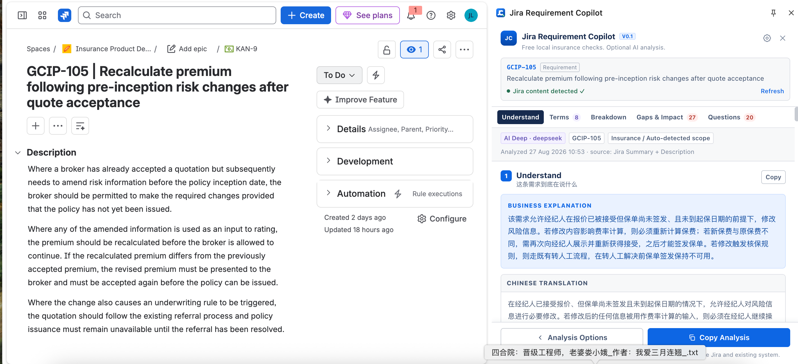
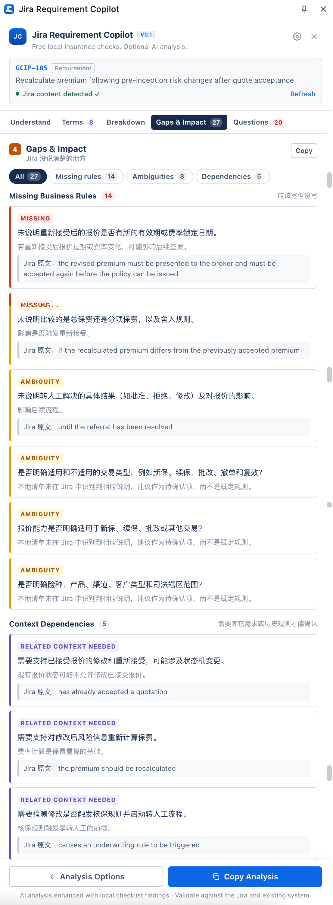
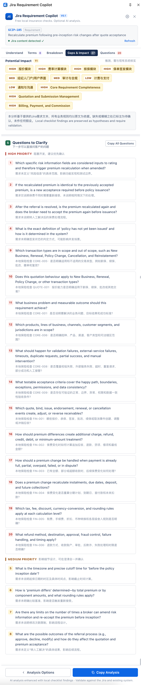

# Jira Requirement Copilot

**Understand requirements. Find gaps. Ask better questions.**

A Chrome side panel that helps Business Analysts read English Jira requirements — and find what they *do not say*.

---

## Why I built this

I have written requirements for insurance systems for 12 years, mostly for UK and Hong Kong teams.

The hard part was never reading English. It was finding what the requirement did not say.

Last year I took over a UK underwriting release from a BA who left suddenly. The document had never been confirmed with the client, and it had **21 open points** — rules that were missing, sentences that could be read two ways, and a reference to an "existing process" that was not defined anywhere. I spent an afternoon pulling them out one by one, then three hours on a call going through them with the client.

That work repeats on every project. This tool does the first pass.

---

## What it does

Open a Jira issue → open the side panel → pick your industry and module → click **Analyze**.

| Block | What you get |
|---|---|
| **Understand** | A plain-language explanation of what the business actually wants, plus a full translation |
| **Domain Terms** | The industry terms used in the ticket, explained — and nothing more |
| **Requirement Breakdown** | Goal, actor, current behaviour, expected behaviour, and the business rules the ticket actually states |
| **Gaps & Impact** | Missing rules, ambiguities, context dependencies, potential impact |
| **Questions to Clarify** | The analysis turned into questions you can send the client, sorted by priority |

If the extension cannot read the Jira page, you can paste the Summary and Description manually.

---

## Design principles

This is the part I care most about.

**1. Every business rule is traceable to the original text.**
If the tool cannot point to where a rule came from, it does not list it as a rule.

**2. If the Jira does not say it, the tool says "Not specified in the Jira".**
It does not fill the gap with a rule that sounds reasonable. In requirement analysis, the dangerous case is not an AI that says *"I don't know"* — it is an AI that is confidently wrong.

**3. "Potential impact", never "Impact".**
The tool has read one ticket. It has not read your system. Anything it flags as impact has to be validated against what you already have.

**4. Terms are explained; rules are not invented.**
The Domain Terms block will tell you what *underwriting referral* means. It will not tell you what *your* referral process is.

---

## Scope of v0.1

v0.1 does one thing: help a BA understand and analyse **the ticket in front of them**.

Deliberately **not** included:

- PRD generation
- Email drafting
- Prototype generation
- Writing back to Jira
- Searching related tickets
- Project knowledge base / RAG
- Multi-agent workflows

These are not missing features — they are decisions. Each one needs project context that this version does not have, and a tool that guesses at that context is worse than no tool.

---

## Roadmap

**v0.2** will be driven by what people tell me it gets wrong. Current candidates:

- Better handling of tickets where acceptance criteria sit in tables
- Saving industry / module presets per project
- Exporting the clarification questions in a format you can paste straight into an email

<!-- 改成你自己真正想做的三条，删掉不打算做的 -->

---

## How it was built

The product requirements, the workflow, and the structure of the output were designed by me.
The implementation was written with AI assistance (Codex / Claude).

---

## Install

This is v0.1 and is not on the Chrome Web Store yet. To try it:

1. Download this repository (**Code → Download ZIP**) and unzip it.
2. Open Chrome and go to `chrome://extensions`.
3. Turn on **Developer mode** (top right).
4. Click **Load unpacked** and select the unzipped folder.
5. Open any Jira issue and click the extension icon to open the side panel.

<!-- 如果需要填 API key，把下面这段留着并改成实际步骤；不需要就整段删掉
### API key

The analysis runs through [填模型服务商]. Before first use, open the extension's Settings and paste your own API key. The key is stored locally in your browser and is never sent anywhere except to the model provider.
-->

---

## Feedback

If you are a BA working with overseas requirements, I would like to know **where it gets things wrong** — that is exactly what v0.2 is for.

Open an [issue](../../issues), or reach me on LinkedIn.

---

## A note on data

Analysis is sent to a language model provider for processing. Do not paste requirements containing real customer data, and check your own company's policy before using it on client tickets. The screenshots in this repository use test data I created myself.

---

## Author

**Vera (Jianzhen Li)** — Senior Business Analyst, P&C insurance core systems (UK / Hong Kong / Mainland China).

[LinkedIn](https://www.linkedin.com/in/vera-jianzhen-li)

---

## License

MIT — see [LICENSE](LICENSE).
